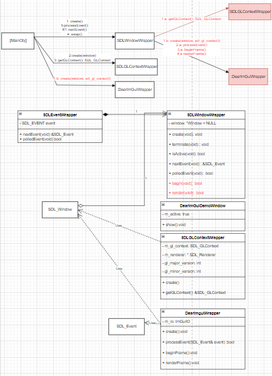

# Task 9: Decouple DearImGui and Hello Triangle 10/10/2022

Related Requirements:
- A polygon Shader
- A Polygon Renderer

Risk
 - Breaking existing working functionality
 - Missing important functionality

What I did or will do
- Refactor the to decouple dearImGui and SDLGLContex from the window

# Design
These classes require redesign
- dear_imgui_wrapper
- sdl_gl_context_wrapper
- sdl_window_wrapper

# Implementation Steps
- remove begin() from SDL Window
- remove render() from SDL Window
- Remove DearImGui from SDLWindowWrapper
- Remove SDLGLContext from SDLWindowWrapper
- Add DearImGui object to main
- Add getWindow to SDLWindowWrapper
- Add imguiWrapper process Event in main
- Add SDLGLContext to main
- After SDLWindow.create, add SDLGLcontext.create;
- After add SDLGLcontext.create, add DearImGui.create;
- Replace sdl_window.begin with dear_imgui_wrapper.beginFrame
- Replace sdl_window.renderFrame with dear_imgui_wrapper.renderFrame()
- Move any function related to openGL wrapping to main
- Make SDLWindowWrapper a struct temporarily

- Check for syntax errors
- Create GLProgram and Shader related abstractions from previous implementation
- Create the Polygon Model based on previous implementations
- Draw the polygon model based on Previous implementations

Part 2 
Write a text file reader
    Writing
    - Create a class called file_reader
    - It should have properties of a 
        - enum this will return the status of the read
        - string for the filename to read
        - string these are the contents of the file
    - It should have a read function
        - if it fails the read it will set the file read enum to failed
            - It will read the File into a string stream
        - if it succeeds
            -it will set the content to be the string that was from the string stream 
    Test
    - As an integration test in using the console window
        - When given a file path
        - print out the text that has been read from the
        - When The string has been printed, I should see the contents of the file, then it has passed
        - Otherwise the program has failed
Part 3
- For next task
<!-- - Create a directory for shaders

- Create a shader called 
    - polygon_position_color.vert
    - polygon_position_color.frag
- Write the vertex shader in the text file
For each vertexIt will
    - Send the color to the fragment shader
    - Sent transform the vector with the uniform matrix
- Write the fragment shader in a text File
    - Output the color that was given to it immediately
It's properties are
- Vertex Data: Vec3 position, Vec3 color
- Uniform Data: viewMatrix: 
- Check that I am able to get the exact text of the fragment Shader when I load it from a file. -->

# Testing
- Test that A am able to see an imgui Demo window
- OpenGL Rendering is still working
- I am able to see the triangle
- Next steps

# Next Steps
- Keep abstractions loose
- Minimise global data
- Improve the requirement specification, so that there is a 1 to 1 relationship between functions and functional requirement