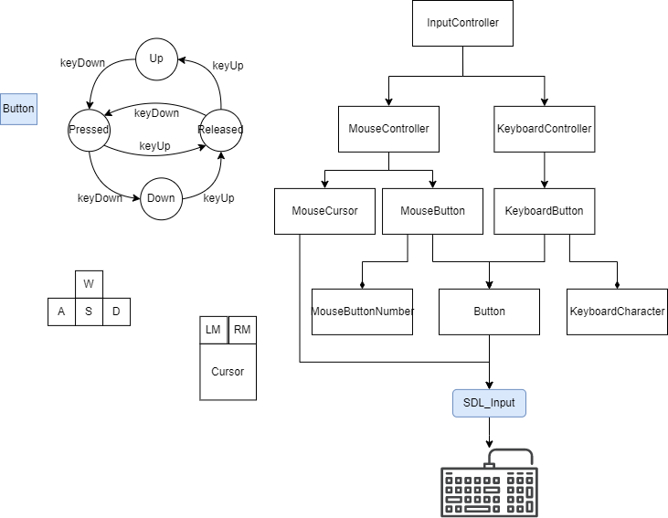
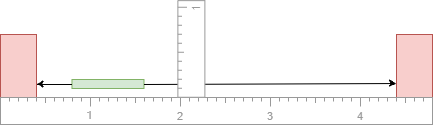
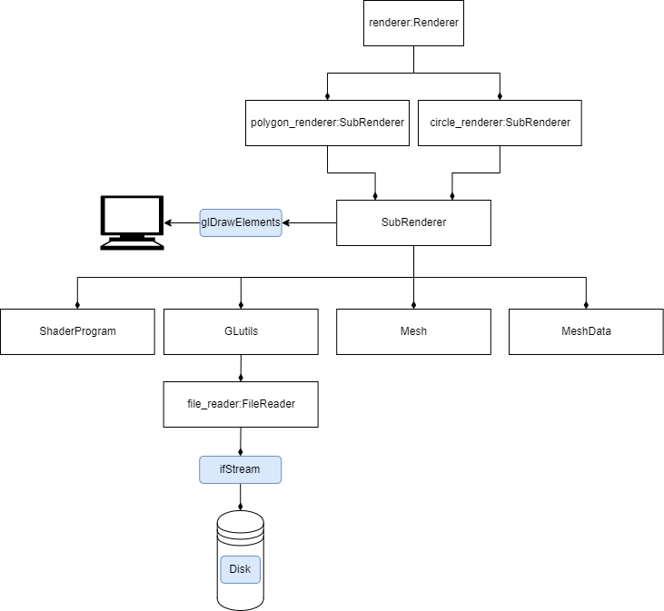

# Games Engine

Unfragmentted information for development
## Contents
1. [Introduction](#introduction)
2. [Environment Analysis](#environment-analysis)
    1. [Hardware Environments](#hardware-environment)
    2. [Software Environements](#software-environment)
3. [Software Rules and Requirements](#software-rules-and-requirements)
    1. [Main Menu](#main-menu)
    2. [Game](#game)
5. [Component Level Functional Requirements](#component-level-functional-requirement)
    1. [Circle Renderer](#circlerenderer)
    2. [File Reader](#filereader)
    3. [OpenGL Utilities](#glutils)
    4. [Mesh](#mesh)
    5. [MeshData](#meshdata)
    6. [Polygon Renderer](#polygonrenderer)
    7. [Rect](#rect)
    8. [Renderer](#renderer)
    9. [Shader Program](#shaderprogram)
    10. [Sub Renderer](#subrenderer)
6. [Implementation Changes](#implementation-changes)

## Introduction 
As part of the overall business goals of creating fun games, and advanced systems that are useful for engineers. I will be creating a game with 2D graphics that is similar to the game breakout. This game has a ball, a paddle and bricks, that can be destroyed. When they are destroyed you the Player earns some points. When the ball goes below the paddle floor then you lose one of the ball, and if you lose all the balls, then you lose the game. To make the game more exiting Powerups that can be used to double the amount of balls in play or have malls that are able to go through bricks rather than bounce of bricks. Attempt to achieve the ideals of the game within the hardware environments and software environments that this game will work within

# Environment Analysis
The system that I am developing is restricted by the Operating system, which is restricted by it's abstractions for systems that run inside it. The devices available are determined by the hardware.

## Hardware Environment
- A Modern Laptop

Inputs
- Plain Text In: Keyboard (Description	Standard PS/2 Keyboard)
- 2D Selection: Pointing Device (Hardware Type Synaptics PrecisionTouchpad Filter Driver)

Outputs
- Graphics Memory: Adapter RAM 512.00 MB (536,870,912 bytes)
- Video Out: HDMI Port
- Data: Disk Drive
- Graphics: 1080p screen
- Audio: AMD High Definition Audio Device
- Processor: AMD Ryzen 5 5500U with Radeon Graphics, 2100 Mhz, 6 Core(s), 12 Logical, x64-based

- Other Systems to consider
    - A modern Phone

## Software Environment
- Operating System: Microsoft Windows 11 Home (Windows File System)
- SDL2
- Output
- File write
- Input
- File Read

Other Software Environments
- Android APK application

# Component Spec

## Renderer
A system that provides commands that can provide graphical data back to the game player or developer, for either gameplay or Game debugging and testing. The current drawable features are a circle, rectangle and it is also used to change the background color, of the game or anything in the viewport. It should be posible to change the width and height of this window. Some subcomponents (shaders) that are used within this renderer are loaded from a file. Currently there are two batches, One Batch designed for rendering Polygons and another batch for rendering circles, They each use diffrenct shaders, They both are able to dynamically add verticies and indicies to the batch in the mesh itself, so that the 2 batches can be rendererd in 2 draw calls. There are additional commands for wrapping every opengl component.

## InputControl
In order to allow a **Player** or a **Developer** to interract with this **Game**, for hardware there is a **Keyboard** and a **Mouse**  used in the Game. For the mouse there is the **Left Button** **Right Button** and a **Cursor**, the cursor should be able to calculate the new position on **InputController** **update**, also the **movement**(delta position) of the cursor should be calculated based on the position of the Cursor from the previous frame. Currently only 4 buttons need to be known by the input controller. The **Forward Button** which is a default to the key **W**, the **Left Button** with default key **A**, the **Right Button** which the default key is **D** and **Down Button** where the default key is **S**. It should be possible to change all these keys. By default it is possible to check whether A key or a button is down or up, Overtime it is possible for the keys to also be in the states **UP, DOWN, PRESSED, RELEASED**, A Button is in either of these states at one frame. Expect more to be added to the input controller.

The transition between the keystates can be represented as a finite state machine. There is a heirarchy of objects that are involved in using the InputController for SDLInput

## The Paddle Movement

The **Paddle** can move **left** or **right** and can be stopped by walls inside the game window. the **velocity** of the paddle should be stored to determine which wall it hit itself.

 

# TimeController
Every 1/60 of a second the game updates, therefore for movement over time the **delta** time will need to be tracked between each frame this will be handled by a **time** controller, so that it is possible to get the **delta time** and use it as an input to the **Paddle** movement function. it should also be used as an input to the **Ball** **move** function aswell. when **Animations** are added it the **delta_time** will be used as an input to progress the **Animation**. It should be posible to check the **average frame rate** of the game every second. This can be verified by observing the frame rate, and asserting in the program that the frame rate is in a range of between 20 and 180 fps.

### Time Filter
Consider this, Every 2 seconds I need to get the current delta time. and store it so it can be used in the FPS function that returns the FPS, otherwise the FPS would be displayed a too many times to read.

The **TimeFilter** will need to store the most recent **value** sampled, and the **previous time** it was sampled, so that after 2 seconds the value can be changed. The value is updated in a function that will take the elapsed time and the new potential value. If the required time is meet then the value will be updated.

## Physics Processor
Every frame, every physics based dynamic game object in the game, the balls, may bounce of multiple objects per frame, iteratively, the game attempts to move the balls to the next frame, if the ball is intersecting something in the game, between the begining of the frame and the end of the frame, then reverse the ball until it is no longer intersecting with any of the objects,then relect the balls velocity along the normal. Repeat this until the ball has been able to move the distance that it should move within the frame, or until that has been 5 bounces for each ball in the game. This will require 

A single object collision detector is not suitable for this, because, to accurately compute the physics, because
- It would presume that only one bounce has occured in a frame

Based on Prototyping, the Physics Processor will need

Physics Processor 
- time_chunk: The time that needs to pass in order for all movements and collisions to have been made within a frame
- bodies: The objects that need to be intersected with between the frame

Body:
- Contains a vector of each fundamental shape
- contains a velocity for when it needs to be resolved
- contains a bounding box that is calculated every time that a new shape is added to it
- Can intersect with another body by first checking if the bounding boxes intersect, then checking that the shapes intersect
- Can be resolved from another body
- When given a pointer to a move functions it is possible to move other object with this ridged body

Scenarios
- Ball hits a wall
- Ball hits a paddle
- Ball Fast moving ball
- Ball bounces off two bricks
- Ball is wedged into wall by paddle

## Ball And Paddle and Walls Bounce off

Consider this, the ball is a Circle and the Paddle is a rect, sometime the ball will hit the Paddle, and the walls. At some time, the ball will hit the rect, then it may hit the wall, for the ball to bounce of the paddle, the time of impact needs to be found so that it can be removed from the time step. The hit normal needs to be found in order to determine the new indended velocity of the ball. To test whether this works there needs to be a way to stress test this, as to verify that this has been implemented correctly. The variables that will affect this are the 
- ball's velocity
- ball's position
- the position of the paddle
- velocity of the paddle

Intermediate variables
- The edge of the paddle that was hit
- the vertex of the paddle that was hit

Consider Testing the underlying functions within an executable that is seperate from the breakout Game

## Collider.exe
This is an executable designed to test the in game physics, you can
- Create physics Scenarios
- Save physics scenarios and run physics scenarios

## Task: Functions Related to Circle Bouncing off Rectangle
- Convert Rectangle to polygon, test this,
- Create an intersection implementation
- Test some of the edge cases

## Move Circle In Sweep 
Moving the circle in sweep so that it can bounce off multiple objects between frames is an iterative action.

While there is some time remaining
    Move the circle For the time remaining
    store the (next time remaining as 0), with the (next normal as 0,0) as closest_object_hit
    for each other object
        the closest object hit's (next time remaining) equals the time till the circle first intersected the object 
        the closest object hit normal is the object hit normal if the time remaining was greater than the previous time remaining
    Move circle back to previous hit point
    the time remaing is the object hit result time remaining 
    reflect the circle velocity based on the normal
            

# Software Rules and Requirements

## Main Menu

| Rule | Detail | Status |
| --- | --- | --- |
| Play Button | Press play to start the game | [-] |
| Options Button | Press options button to go to the screen, Where things like the game control layout can be changed | [-] |
| Quit Button | Quits the game as if the window was being closed| [-] |

## Game

| Rule | Detail | Status |
| --- | --- | --- |
| Pausing | When the pause button is pressed, everything that is not covered by the pause menu is rendered, this provides access to modify the game options and pause the actions of the game | [-] |
| A ball | There is a circular ball, that can bounce of the paddles, bricks and walls in the game world and can move at a velocity | [-] |
| A paddle | There is a rectangular paddle, it can receive powerups and have the ball bounce off it | [-] |
| Powerup | A object that falls and is applied when it hits the paddle | [-] |
| Bricks | Bricks are rectangular circular or polygonal objects that need to be destroyed to win the game level. | [-] |
| Ball bounce of paddle | When the Ball hits the Sides of a paddle it should bounce of it's side When the ball hits the top of a paddle, The more left it is on the paddle, the more left it should bounce away, the more right it is on the paddle, the more right it should bounce away | [-] |
| Ball hits a Wall or ceiling|The ball should reflect along the wall based on it's normal | [-] |
| Paddle hits wall | When the paddle hits the left wall it should prevent the paddle from going further left, when the paddle hits the right wall it should prevent hte paddle from going further right | [-] |
| Ball hits a brick default | A ball can hit the brick, and destroy the brick, this will then add points to the level, and mark progression in the game level. | [-] |

## Game Pause
| Rule | Detail | Status |
| --- | --- | --- |
| unpause | press unpause button to unpause the game, make sure that this does not invalidate the games' physics | [-] |

# Component Level Functional Requirement
Many of the tasks in the game are encapsulated into sub components like the renderer, for tasks such as rendering

## CircleRenderer
Is a subrenderer that speciallises in rendering circles, that are ultimately created based on filtering fragments from a quad rather than as a polygon.

| Name | Inputs/Preconditions | Dependancies | Processes | Outputs/Postconditions | Status |
| --- | --- | --- | --- | --- | --- |
| add quad | A Rect and   this SubRenderer has been constructed | Rect MeshData push rect, with color and unitcoord function | delegates adding the quad to meshData | The mesh data has the added position, color and unitCorrdinate vertex properties added to the meshData | [-] |

[1] : Inherites all functions and properties of SubRenderer

## Filereader
| Name | Inputs/Preconditions | Dependancies | Processes | Outputs/Postconditions | Status |
| --- | --- | --- | --- | --- | --- |
| read file | a valid or invalid file path | input file stream stringstream | Reads the file with input file stream  pushes the content to the stringstream  copies the string in the stringstream to the text content property | Case1: (valid file path) -> The file text content is equal to the content in the file  The file read content status is marked as success   Case 2: (invalid file path) -> The file read status is marked as failed | [-] |

- files read by this must have a line length that is lessor equal to 2048 characters

## GLutils
OpenGL utilities for creating shaders and creating the programs of a shader

| Name | Inputs/Preconditions | Dependancies | Processes | Outputs/Postconditions | Status |
| --- | --- | --- | --- | --- | --- |
| makeProgram | The vertex shader file  the fragment shader file | OpenGL initialised Optional Log flags| Creates the Program Delegates the creation of each shader MakeShader with it's shader type as an input Logs the shader if it is possible   Deletethe Shaders  | Returns the Shader Program ID (GLuint)| [-] |
| makeShader | The shader file The shader type  | OpenGl Initialised Optional Log Flag | Create the shader Load Shader Content from file Compile the shader Log the shader status | Returns the shader Id | [-] |

## Mesh

A mesh is used to manage two common buffers of a mesh, the vertex buffer and the index buffer, this can be updated.

| Name | Inputs/Preconditions | Dependancies | Processes | Outputs/Postconditions | Status |
| --- | --- | --- | --- | --- | --- |
| construct  | no Inputs | OpenGL initialised | creates the openGLBuffers Binds the buffers  | Mesh can be bound and updated |  [-] |
| bind  | this is constructed | OpenGL Initialised | Binds the two mesh related openGL buffers | The mesh is binded | [-] |
| update | this mesh is or is not binded  vertex array   index array, or MeshData | Open GL intitialisation  | Binds this mesh then updates the mesh data based on this input | The mesh is updated, therefore it should match how it should look based on the new mesh data  | [-] |

## MeshData

A meshData is used to store and build the data related to creating a mesh, most rendering systems represent a mesh as polygons, most of the functionality converts Shape types such as a rectangle, to vertcies with positions on a coordinate system, the color of the vertex and other properties of the vertex.

| Name | Inputs/Preconditions | Dependancies | Processes | Outputs/Postconditions | Status |
| --- | --- | --- | --- | --- | --- |
| construct | None | vector[float] vector[unsigned int]  integer| Sets the MeshData to it's default state | vertex array is empty  index array is empty the index offsets are set to 0 | [-] |
| add rectangle with color | rect and colour | object dependancies | Pushes the position of each rectangle vertex and the color | This vertex array and index array, contains the additional verticies and indicies | [-] |
| add quad with color and unit position | rect and colour | same as object dependancies | push the rectangle vertex positions  push the color  push the unit coordinates | vertex and index array has additional data | [-] |

## PolygonRenderer

| Name | Inputs/Preconditions | Dependancies | Processes | Outputs/Postconditions | Status |
| --- | --- | --- | --- | --- | --- |
| add quad | A rect | Subrenderer meshData | delegates to the sub rendererer mesh data to add the quad to be renderered | The MeshData object in the sub renderer has new vertex and index data | [-] |

[1] : Inherites all functions and properties of SubRenderer

## Rect

| Name | Inputs/Preconditions | Dependancies | Processes | Outputs/Postconditions | Status |
| --- | --- | --- | --- | --- | --- |

## Renderer

| Name | Inputs/Preconditions | Dependancies | Processes | Outputs/Postconditions | Status |
| --- | --- | --- | --- | --- | --- |
| construct this | Color | OpenGL Context Initialised | Construct the rendererer to make it | Circle Renderer constructed Polygon Renderer constructed Adding a circle and a rectangle should be possible  | [-] |
| add rect to renderer | Color PolygonRenderer with add rect method | Created this Renderer component  Matrix set for the rect to be visible | Render a rectangle after it has been added to the renderer | A rectangle of the specified dimensions should be visible on the screen | [-] |
| add circle to renderer | The CircleRenderer: add rect function[1] | Same as ADD RECT | Render a circle after it has been added to the renderer | A circle is visible on the screen | [-] |
| render | this object to have been constructed  a circle or rect added | Circle Rect | Make a call to renderer to render the content | Previously added circles and rects are visible on screen | [-] |
| Set the matrix | this has been constructed | CircleRenderer set matrix function PolygonRenderer set matrix function | Sets the matrix property that will be used in the next call to render | Sends the matrix to all subRenderers until it is used to be renderered | [-] |

[1]: The subrenderer uses a quad because it the circle is created from the quad

## ShaderProgram

A wrapper for the shader program and it's vertex attributes.

| Name | Inputs/Preconditions | Dependancies | Processes | Outputs/Postconditions | Status |
| --- | --- | --- | --- | --- | --- |
| create | ShaderID, Vertex attribute | OpenGL initialised | sets the shaderId as the one provided by the input | This object is ready to use | [-] |
| use | None | OpenGL initialised | gl use shader and also enables the vertex attributes of this shader | this program is currently active | [-] |
| setMatrix | float pointer | glm matrix | Set the matrix with openGL in this shader based on the pointer given | Shader matrix has been changed | [-] |

## SubRenderer

Used by the renderer to manager the ShaderProgram, the MeshData and the Mesh, for the current batch of meshes to render.

| Name | Inputs/Preconditions | Dependancies | Processes | Outputs/Postconditions | Status |
| --- | --- | --- | --- | --- | --- |
| construct this | OpenGL Context Initialised | ShaderProgram GLutils Mesh MeshData Rect | Construct the sub Renderer by constructing the contents that make up this object | To be able to add a quad to be renderered with this subrenderer  For all the dependant objects to be correctly initialised | [-] |

# Designs

## Renderer Domain
Object Composition

