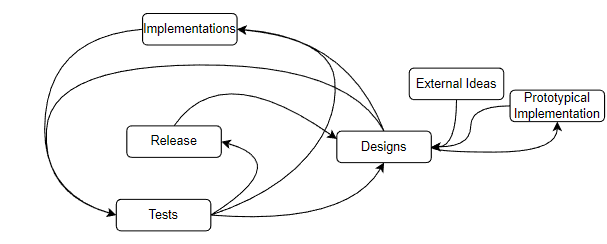
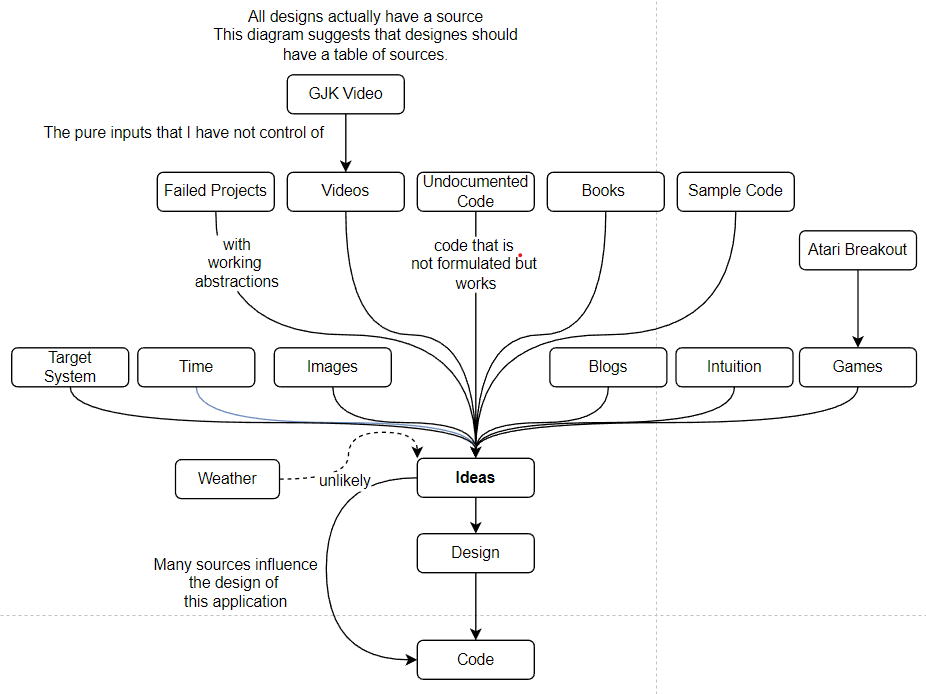
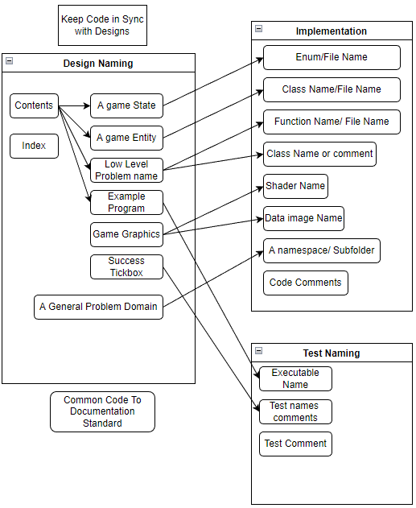
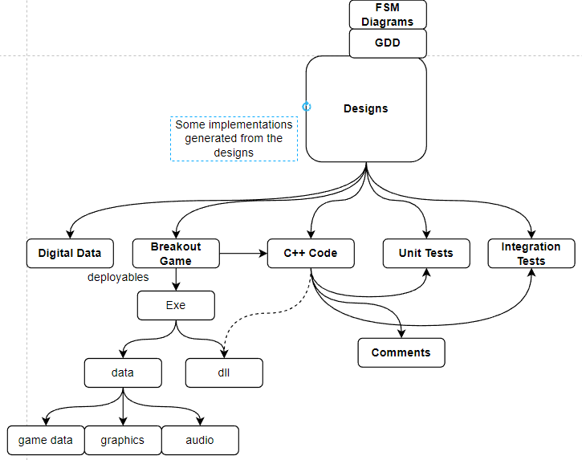

# Software Development Process

The Software Development Process has the Stages
- Prototypical Implementation
- Design
- Implementation
- Test
- Release

## Prototypical Implementation
Prototypical Implementation is implementation that intuitively fullfills a design of the program

### Input From Prototypical Implementation
In some circumstances I might need to check if something is even possible within this environment. The feedback from this will inform if what is being designed is feasible

---

## External Ideas
These ideas come from feature that may exist in things that I do not control, but can choose to take influence from similar games, videos and books.

### Input From Ideas

---

## Designs 
These specify in a simple precise and organised way, of the rules, objectives and objects of the game or system

---
### Input from External Ideas  
These come in the form of ideas for new game rules, objects and other Game related concepts, with references to parts of the external content that informed a particular piece of design.

### Input From Prototypical Implementation

But it was developed in a less refined Software Development Process model, an exploratory development model, or a big bang model. 

### Input From Release
After a release, there might need to be changes to be made to the system, this could be from user bug reports or user requested features.

### Input From Test

Tests either expose design flaws, A need to create a sub system for testing a subset of the system or that the design has achieved what it was ment to achieve.

## Implementation
Modifications to the source code based on the systems design

### Input From Design

Design diagrams such as finite state machines, uml diagrams, and  task formulations that describe the changes diagrams will be be turned into source code, shader code and data files

### Input From Test

When a test fails, it the bug is easy to find, then it is unlikely to have been caused by a design flaw. 
---

## Test
Running thes tests to see if they pass or fail. If they test things such as the frame rate then test if the test is within an acceptable or unacceptable range.

## Input From Design
Some design changes will require parts of the program to be retested or for tests to changed or for some tests to be removed

## Input From Implementation
Test the implementation to see if it conforms to the design, or 

---

## Release
Only occurs when the software is complete or after, making changes to the software even after completion

### Input From Test

After testing the software, if it meets it's criteria it is ready to be released.

---

For each Change that is made, they are mentioned in the change log from to to bottom

- To control the version of the software git will be Used

- For every task
- Modify the design
- From the Design Modify the Tests
- Commit with Git
- Push Changes to Github

## Naming Convention
Consider this style of naming convention, this is not exact, but because I can make comments in code, I will be able to relate these comments back to the documented  designs.

## Design Outputs
These are likely to be the kind of implementations that I expect for this system.

## Inversion of Control or library
When designing the game or program. I can either
- make a call to a method from a library, and provide it with the input required, so that it does the intended result
- Have a subsystem that will have responsibility over an object when the object is initialises

### Examples of inverted control
As part of the role of providing an abstraction for all rendering, the ShaderPrograms that are used are not exposed to the main application. However when the application is being initialised, the program loader loads the shaderr
- A renderer requires the input of a shaderProgram (as it is not able to read it from the file)
- Or since only circle renderer only has one valid shader that can be used *Maybe the Renderer should have the responsibility of loading the shader, from the predetermined file path* (to fullfill it's responsibility of encapsulation) 
- If there were multiple valid shaders, then I could use the builder pattern to instantiate the shader after the renderer has been created.
### Examples of not using inversion of control
I could have used inversion of control for the games ball physics, so that the physics engine has a reference to the Shapes in the game that the ball can bounce of, however I decided not to because, I want to be able to destroy bricks, as soon as the ball hits it, rather than have to output a hiearchical data structure that represents all the bricks that were hit
- A physics solver has everything it needs to function

### Semantics of the Design Document
It appears that If I was to display the entire design of the renderer, there would be too much information to describe, however, If my design document is focused on the new increments and how it changes the program, it would better inform the design. Starting with a high level component like the renderer, and showing it being guilt up from bottom up.

### Consider Using an alternative Unit Testing Framework to Libcester
Libcester is a framework for c, therefore there isn't a way to assert c++ strings. I will explore **Catch2** since it seems like an alternative good SOlution to unit Testing
- This Exploration will be somewhere in my local DEV/Catch2Sample.

I got Catch2 working after using the amalgamated release

### Conside the software architecture
Choice 1: 
I will use the architecture that is a layered architecture that goes down. Ending at the Operating systems interface between the hardware like the Graphics card, the hard disk and the Keyboard Any component that is able to have access to the disk does this through a fileReader

Choic 2
An architrecture that only provides abstractions between a single hardware component. 
- A renderer can only output Data to the monitor, an Asset Loader can only load things from the disk, this will likely reduce the number of Object in the program, so that there is only one place in the program where a class is used.

Choice 3 
An traditional object oriented architecture

Considering that the hardware that the game runs on is likely to have multiple process, it may be required that things like loading from a file is done inside another process, as a way to avoid the main(render) process from being slowed down, due to having to read the data from the file. A layerered architecture might be good for this. Othersie the traditional object oriented architecture is Good

Choice 4
A more modular architecture architecture

### A justification of Virtual Functions

### New Variable naming
- Do not use m_ for class variables, rather always use **this->**